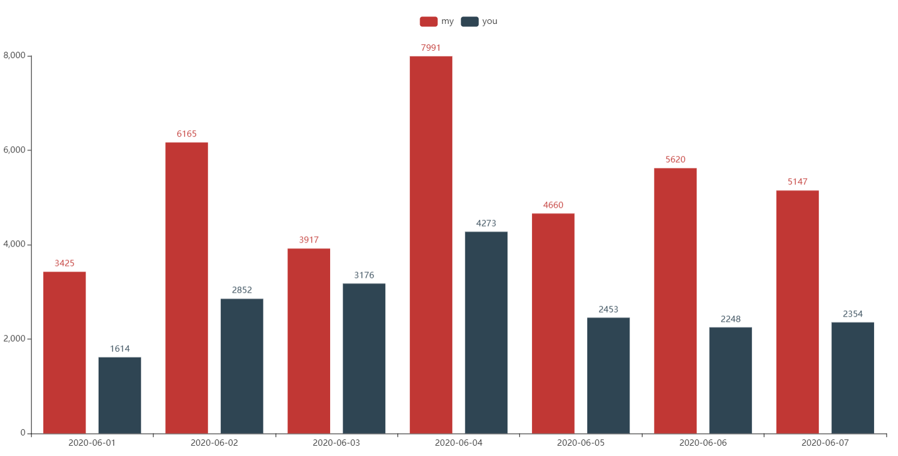

## wechat_analysis

#### 原理

使用工具解密微信数据库，通过对解密后的 db 文件中的聊天记录进行分析从而得出 HTML 图表。

微信数据库解密工具地址：[https://github.com/libra146/decrypt_wechat_database](https://github.com/libra146/decrypt_wechat_database)

#### 使用方法

需要准备一个已解密的 db 文件，和一个具有读写权限的文件夹 (/home/xx/xxxx/)，将 db 文件放到可读写文件夹中，还需要安装好 docker。

首先执行 `docker push libra146/wechat_analysis` 拉取 docker 镜像

准备好需要分析聊天记录的人的微信号，这里假设为 wxid_xxxxxxxxx 

之后运行 `docker run --rm -it -v /home/xx/xxxx/:/root/wechat/data -e TALKER=wxid_xxxxxxxxx  libra146/wechat_analysis` 即可

运行成功输出如下：

```bash
Building prefix dict from the default dictionary ...
Dumping model to file cache /tmp/jieba.cache
Loading model cost 0.658 seconds.
Prefix dict has been built successfully.
success!
```

在可读写的文件夹中会生成以微信号为文件名的 HTML 文件。

如果有异常，欢迎 PR 反馈。

HTML 图表内容类似于：

> 以下数据随机而来

- 每个人聊天记录条数按天数分布


- 每天聊天记录条数按时间分布


- 词云


- 每天每人聊天记录字数统计



- 等等，图表内容可添加，欢迎 PR。

#### TODO

- [ ] 给图表添加标题
- [x] 通过 docker 进行自动化分析
- [ ] 添加新的分析

